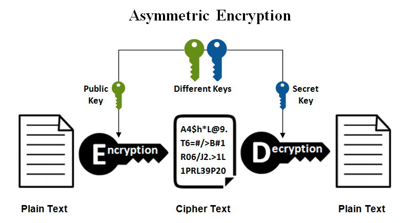

# Importance of Security: An Introduction to RSA and the Secure Boot Process

## Why do we need secure boot?
As technology evolves, we are found in an era dominated by digital connectivity as well as data-driven operations, where the security and integrity of computing systems have been more important than ever. Imagine if a device that is responsible for the functioning of a hospital or financial institution is compromised during startup; or if someone with malicious intent was able to gain control over the core components of your device before the OS is even launched.
Malicious actors could manipulate firmware and bootloader code or even inject harmful software at the very foundation of your device. 

This documentation aims to explain how RSA is employed in the Secure Boot process to verify the integrity and authenticity of firmware and operating system components.

### How do you prevent security issues and gurantee that the OS you are loading on your device is untampered with?
Secure Boot addresses this concern by verifying the digital signatures of the OS kernel and critical system files, ensuring that you are running a legitimate and risk-free operating system

Secure Boot is essentially a security feature implemented in modern computer systems and embedded devices to guarantee that only trusted software is executed during the boot process.
Secure Boot involves a chain of trust, ensuring that each component loaded during the boot process is signed and verified before execution. RSA plays a critical role in this digital signing process.

## What is RSA?
RSA is an asymmetric encryption algorithm, meaning it uses a pair of keys where one key is used for encryption and one key is used for decryption. The security of RSA relies on the difficulty of factoring the product of two large prime numbers, making it computationally impossible to derive the private key from the public key.

### The Math behind RSA

#### Key Generation
1. Choose two distinct prime numbers, p = 11 and q = 17.

2. Calculate n = p x q, in this case 11 x 17 = 187. This term is called the modulus

3. Calculate the Eulers Toient Function ϕ(n) = (p-1) x (q-1) = 10 x 16 = 160

4. Choose a public exponent e such that 1<e<ϕ(n) and e is coprime with ϕ(n). Let's choose e=7.

5. Calculate the private exponent d such that d≡e^(mod ϕ(n)). In this case, d≡23.

6. The public key is (e, n) and the private key is (d, n). Where e = 7, n = 187, d = 23

#### Encryption

1. Allen wants to send a message like M=88 to Kai. Kais public key is (e,n) = (7, 187)

2. Compute the ciphertext C using C≡M^(e)(modn). So, C≡88^ (7) (mod187) which is 11.
3. The calculated ciphertext is sent to Kai using his public key

#### Decryption

1. The calculated Ciphertext C = 11 is sent to Kai
2. Kai will use his private key (d,n) = (23, 187) to decrypt M ≡ C^(d)(mod n). So now we have that M ≡ 11^(23) (mod 187)
3. The result is M = 88 which is the original message we sent!

##### This is just a simple explanation of the math behind RSA, and in reality much larger numbers are used to guarantee that the private key cannot be derived from the public key

### More Examples of where RSA is used

## The importance of security in software development