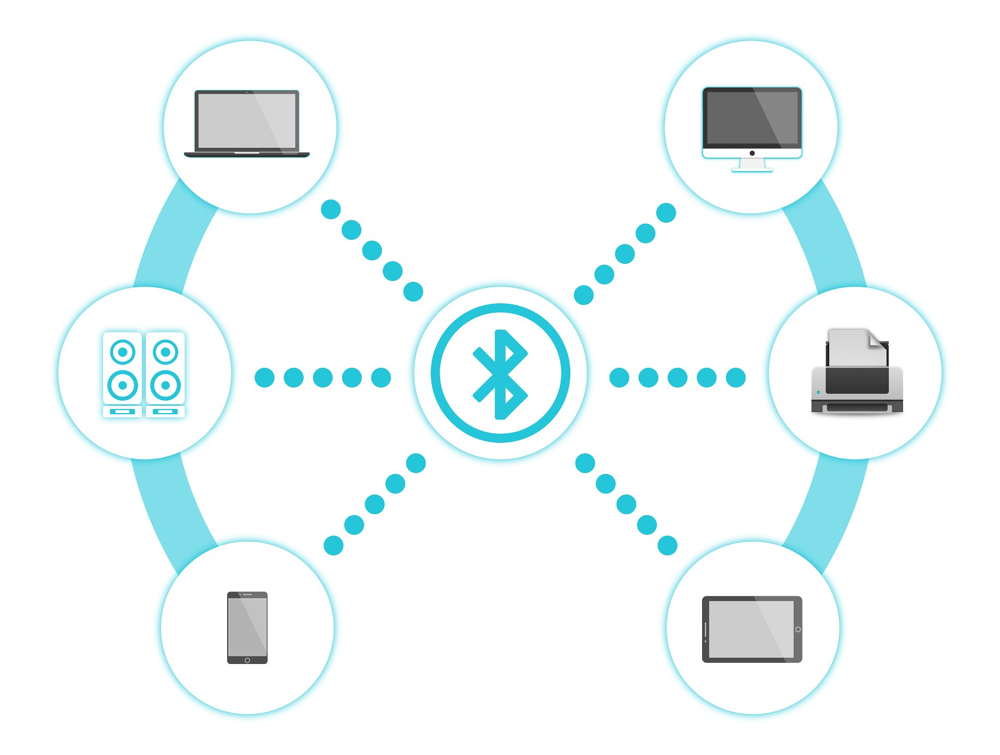
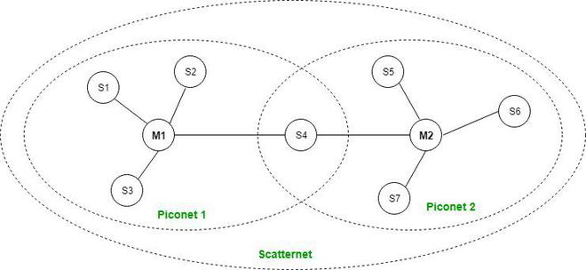

# Understanding Bluetooth in Mobile App Development

## Introduction to Bluetooth

> Image credit: CC0 Public Domain

### Principles for Data Communication

As a wireless technology, Bluetooth is used to exchange data between devices over short distances. Since the fundamental functionality of Bluetooth technology
is to enable communication between devices, it is important to understand the principles of data communication.

There are several characteristics of Bluetooth technology that are important to understand:

#### Delivery

Bluetooth technology is designed to deliver data between devices. This means that data from one device must be delivered to and received by the correct destination device.

#### Accuracy

Data transmitted over Bluetooth must be accurate. This means that data received by the destination device must be the same as the data sent by the source device, with no alterations or errors. Think of the scenario where your phone tries to play a song over a Bluetooth speaker, but the song is distorted or skips.

#### Timeliness

Data transmitted over Bluetooth must be delivered in a timely manner. Continuing the example of playing a song over a Bluetooth speaker, the song should play without any noticeable delay or lag. When you press play, the song should start playing immediately.

#### Jitter

Jitter refers to the variation in the time it takes for data to be delivered. Specifically for audio and video transmission, it is the uneven spacing between data packets. For example, you might have noticed slight cuts in audio or video when using Bluetooth headphones or speakers. This is an example of jitter.

### Architecture of Bluetooth Technology

Being a type of Wireless Personal Area Network (WPAN), the architecture of
Bluetooth can be defined using two types of networks: piconet and scatternet.

#### Piconet

A piconet is a minimal network of devices connected using Bluetooth technology.
Here, it contains a primary node called the master and one or more secondary
nodes called slaves. The communication between the master and the slave can be
one-to-one or one-to-many, but it is restricted to only master-slave communication,
with no slave-to-slave communication allowed. The master is responsible for the
synchronization of the piconet.

#### Scatternet

A scatternet is a network of piconets interconnected by a bridge device. This
bridge node essentially acts as a slave in one piconet and a master in another.

> Image credit: raman_257, Geek for Geeks

### Applications of Bluetooth in Mobile Use Cases

Bluetooth is a Wireless Personal Area Network (WPAN) technology that is widely 
used in mobile app development. Due to its feature of short-range communication, 
we have commonly encountered Bluetooth in various mobile use cases, especially
when our phones are used as the source of data. For example, we use Bluetooth
to connect our phones to wireless headphones, speakers, and other audio or
video devices.

While sending data from our phones to other devices is a common use case,
Bluetooth is also used to receive data from other devices, and this typically
involves specially designed mobile apps to deal with data transfer. For example,
in the healthcare setting, many wearable medical devices use Bluetooth to send
data to a mobile app for monitoring and analysis. This method eliminates the
need for wired connections and allows for more mobility and flexibility for the
device design. However, unlike broadcasting data to a speaker, these type of 
data transfer are rather lightweight, but require a high level of accuracy and
timeliness, as well as a low energy consumption for the advertising device.
Therefore, an alternative to the most common Bluetooth technology, Bluetooth
Low Energy (BLE), is often used in these cases.

## Understanding BLE

Since a common use case in which Bluetooth is used in mobile app development is
to send and receive data from other devices, (as in a mobile app is developed
to communicate with a wearable device), it is important to understand the
principles of Bluetooth Low Energy (BLE).

### What is Bluetooth Low Energy (BLE)?

## Developing with BLE in React Native

## References:

- [Data Communication Terminologies](https://www.geeksforgeeks.org/data-communication-terminologies/?ref=ml_lbp)
- [What is Bluetooth?](https://www.geeksforgeeks.org/bluetooth/)