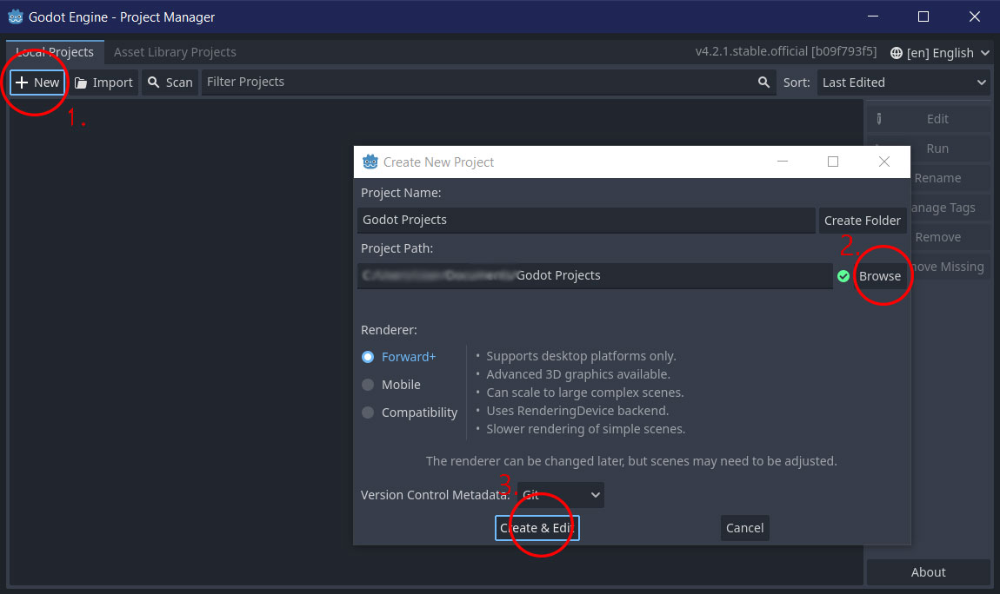

# Intro to Godot

## What is Godot?

Godot is an open source game engine which is considered a versatile platform for developing 2D as well as 3D games to release on the web, mobile, desktop and even console![^1]

It was originally developed in 2001 by an Argentinian Game Studio. Ever since it got released as an open source game engine, the features it provide has tremendously improved.

Some games one might recognize that are made by the Godot game engine includes would be games like Dome Keeper as well as Endoparasitic.

## Features

The features it includes are:
- Code Editor
- Animation Editor
- Debugger
- Tilemap Editor and More
- It supports Blender
- It supports C# programming
- It also has a custom programming language called GDScript which is similar to python in terms of syntax

## How to Get Started
### Installation
1. Go to the Godot [official website](https://godotengine.org/) and download the engine.
	- There's 2 types of engine, one is the latest version and the other one is the Long Term Support (LTS) version
	- I will be using the Latest Version (4.2.1) for this intro.
2. Unzip the folder and open `Godot_v4.2.1-stable_win64.exe`
### Starting a new Project
After opening the game engine, you'll see something like this:

To create a new project you'll have to:
1. Click on `New`
2. Create a folder to store your project
	- Note: Creating a project will not create a new directory, it'll simply put all the required files within the path you set it to.
3. 
## References
[^1]:[Introduction to Godot](https://docs.godotengine.org/en/stable/getting_started/introduction/introduction_to_godot.html)
