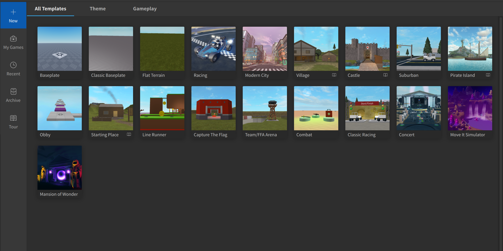
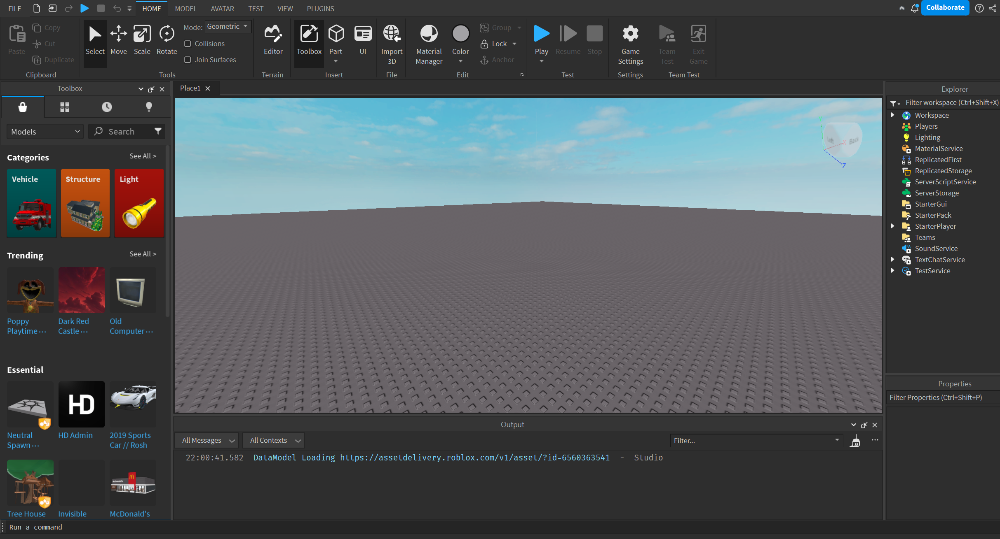
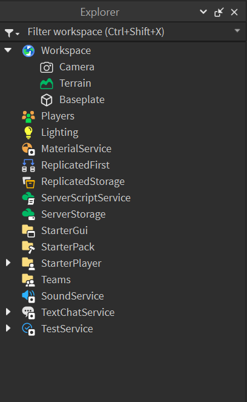
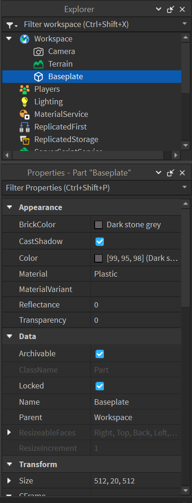

# Introduction to ROBLOX Studio

## Table of contents
#### [Introduction](#introduction)
#### [Download](#download)
#### [Creating a New Project](#creating-a-new-project)
#### [ROBLOX Studio HUD Overview](#roblox-studio-hud-overview)
#### [Getting Started with Your First ROBLOX Experience](#getting-started-with-your-first-roblox-experience)
#### [Further Reading](#further-reading)
#### [References](#references)

## Introduction 
Let's be honest, I'm fairly certain most of you reading this know what ROBLOX is. In certain corners of the internet it's renowned as "the funny lego game" and is the source of many memes and cursed images.

But in case you didn't know, ROBLOX is a multi-billion-dollar platform that lets users create their own games (dubbed "experiences") in their own engine, which can then be uploaded to the ROBLOX website for all to see. Users can also create their own avatars that they can play as in these games.

It's kind of like Scratch (come on, you've gotta know what that is!), but instead of making projects by dragging and dropping code blocks, ROBLOX uses a full-on scripting language they call [Luau](https://luau-lang.org/). It's not as rich in features as something like Unity or Godot, but it's simple and easy to learn.

At first glance a lot of people may dimiss ROBLOX as not being a "real" game engine, mostly due to the blocky style that most games have:

*Me having a chat with an NPC in "Work at a Pizza Place"*

*Me on a rubber duckie in "Natural Disaster Survival"*

But the truth is, ROBLOX really is capable of some awesome things:

*One of my theme parks in "Theme Park Tycoon 2", which features an advanced coaster builder that can rival that of Planet Coaster (believe me, I've tried both!)*

*RetroStudio, which allows players to create their own games emulating different eras of ROBLOX - an engine made in ROBLOX itself!*

There are a lot more but then the introduction would be too long, so let's just get started.

## Download
The first thing you'll need to do is create a ROBLOX account. Once you do that, you just need to head over to [the create page](https://create.roblox.com/landing) and download ROBLOX Studio. Easy!

## Creating a New Project
Upon opening ROBLOX Studio, you'll be greeted with this page:

You can see there are many starter templates for you to choose from. Let's start simple and fresh with the second option, "Classic Baseplate."

## ROBLOX Studio HUD Overview

On the left side is the toolbox, this is where you can find lots of free models you can use. If you don't see it, you can enable it by pressing the "Toolbox" button in the top bar.

On the right is the explorer, where you can see the full object hierarchy of your game. At the bottom of it is the properties panel, where you can view the properties of selected objects.

In the middle of the screen is the camera. You can use the WASD keys to move the camera around, and right-click + drag to rotate it. You can hold the Shift key with WASD to move it slowly. You can also click and drag the scroll wheel to pan the camera.

At the bottom of the camera is the console output. If you don't see it, go to the View tab (at the top of the screen) and press the "Output" button. While you're at it, make sure the command bar is enabled by pressing the "Command Bar" button, too.

You can also enable the explorer and properties panel if you don't see them, too.

### The Workspace
Open up the workspace in the explorer panel, and you should see this:

Look familiar? It's just everything currently in the game's playable area! The Camera refers to the main camera used when playing the game, the Baseplate is the giant grey block that forms the ground, and Terrain is the base object for any terrain in your game (we will ignore this for now, head to [Further Reading](#further-reading) if you want to know more).

### The Properties Panel
Select the Baseplate in the explorer and go to its properties.

Notice that you can't select the Baseplate in the preview window. This is because of the *Locked* property. I recommend keeping this on as you don't want to accidentally select something so big.

In the Appearance section, you can play around with properties such as color, material, and transparency.

If you scroll down, you'll find a lot more properties such as size and position.

There are a lot more properties you can play around with and I encourage you to explore them!

### The Command Bar
ROBLOX Studio offers a command bar that can execute code while in the editor, instead of during runtime. Since ROBLOX doesn't have prefabs like in Unity, you can use the command line to loop through objects and apply properties en masse.

As an example, type in `print("Hello, World!")` in the command bar, hit enter, and look at what appears in the output window!

Remark: since Luau doesn't care about indentation, you can execute any program in the command bar!

## Getting Started with Your First ROBLOX Experience

## Further Reading
[Terrain](https://create.roblox.com/docs/parts/terrain)

## References
[ROBLOX Create Page](https://create.roblox.com/landing)

[Luau](https://luau-lang.org/)

### Games Mentioned
[Natural Disaster Survival](https://www.roblox.com/games/189707/Natural-Disaster-Survival)

[RetroStudio](https://www.roblox.com/games/5846386835/RetroStudio)

[Theme Park Tycoon 2](https://www.roblox.com/games/69184822/Theme-Park-Tycoon-2)

[Work at a Pizza Place](https://www.roblox.com/games/192800/Work-at-a-Pizza-Place)
