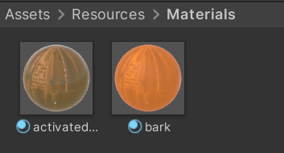
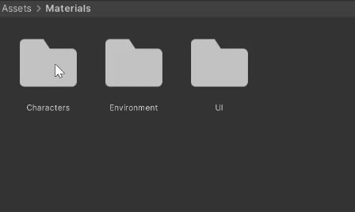
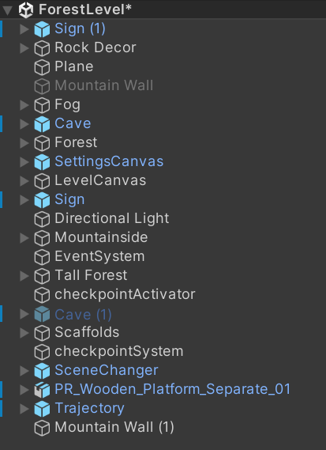
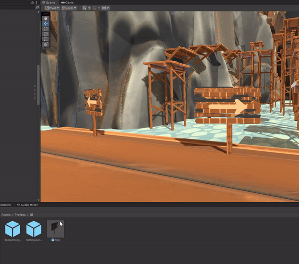
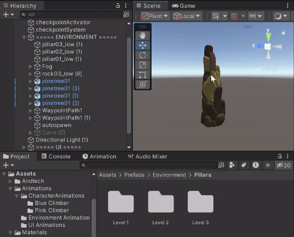
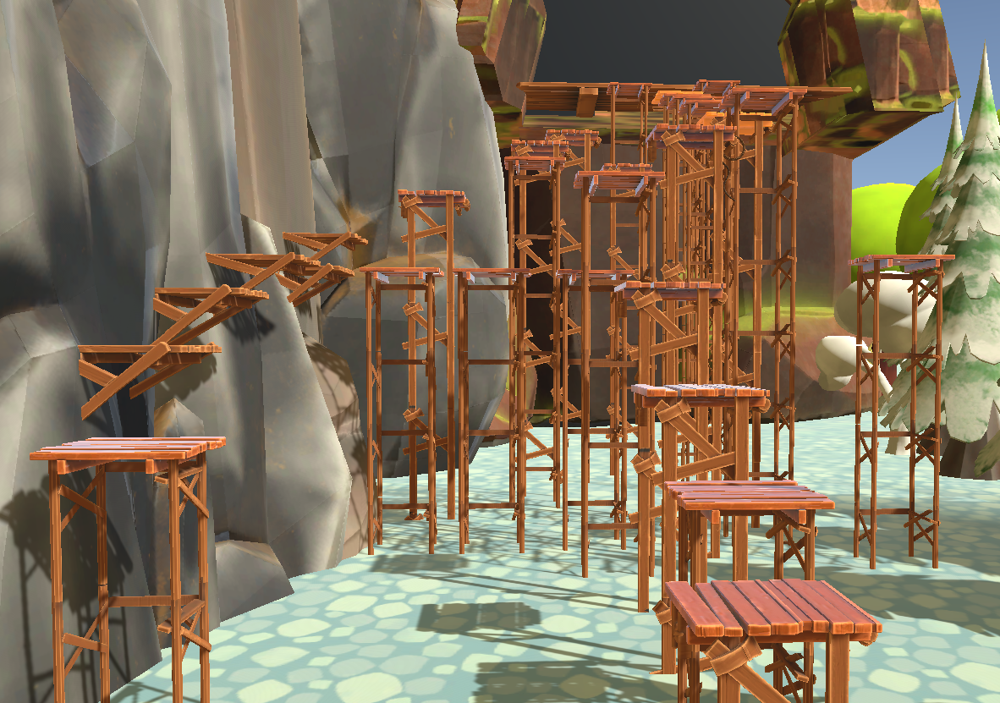
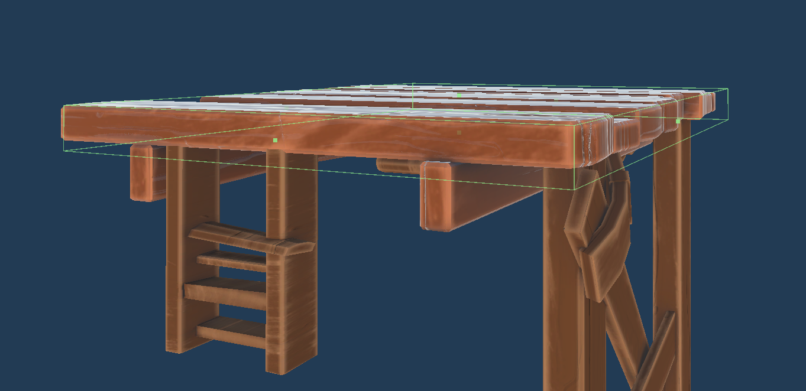

# Introduction to Unity Organization

## Table of contents
#### [Introduction](#introduction)
#### [Organizing your Unity directories](#organizing-your-unity-directories)
#### [Organizing your Unity hierarchies](#organizing-your-unity-hierarchies)
#### [Organizing your prefabs](#organizing-your-prefabs)
#### [References](#reference)

## Introduction 
One of the hardest parts of any project is how to get started when faced with a blank, clean slate. An easy and quick way to get your game rolling is by organizing your workspace. Unity is a powerful and versatile game engine, capable of supporting games ranging from small to large. However, as your game grows, so do your files and objects, so organization is key in keeping track of your assets. Especially when working in a team, it is imperative to keep your Unity project organized, so that everyone knows where to find, place, or change files, objects, or prefabs. Without further ado, let's get started!

## Organizing your Unity directories
### Initial directories
You open a fresh new Unity project, but be wary of creating objects and prefabs willy nilly. Almost every file you create will be put inside the Assets folder of your project, but you should almost never find yourself placing a file directly inside of that folder. Instead, one of the first steps when you make your game should be to create subdirectories inside the Assets directory.

There are three subdirectories that should be in every game you create: Prefabs, Scenes, and Scripts.

While not always present in every game, the following subdirectories are common and prevalent enough in most games, that you will also most likely need to create the following subdirectories as well: Animations, Images (or Sprites), Materials, Resources, Sounds, and Miscellaneous.

### File types
Each of the subdirectories you make will typically only hold files of a certain type, with few exceptions. You can use the following list as a guide on what filetypes should go in which folders.

#### Animations
* .anim
* .controller (for animator controllers)

#### Images
* .jpg
* .png

#### Materials
* .mat
* .jpg (for textures)
* .png (for textures)

#### Prefabs
* .prefab

#### Scenes
* .unity
* .exr (for cubemaps of your scenes)
* .lighting (for lighting settings of your scenes)
* .asset (for lighting settings of your scenes)

#### Scripts
* .cs

#### Sounds
* .wav
* .mp3
* .ogg
* .mixer (for audio mixers)

#### Miscellaneous
This subdirectory will hold all the assets that you will most likely not have as many files of a certain type for. An example of this would be a Fonts folder within this directory, that will hold the .asset and .ttf files of fonts that you import into your game. If you find that your game will be using many different fonts, it may warrant being its own folder outside the Miscellaneous one, but for most beginner games, having one or two imported fonts will be sufficient.

#### Resources
This subdirectory is unique, as it is a special folder in Unity. Files inside the Resources folder can be loaded through scripts into your scenes, rather than through instances you create in the Unity Editor. Placing files here should be done sparingly as it will bloat your build, slowing down your game.

An example of using the Resources folder is to change the material of an object after a character collides with it.

In the above image, you can see that in this script, I load two materials into their own variables. Resources.Load will look inside the Resources folder using the given path and file type to create a reference to it inside of the code. Here is what the paths look like inside the Unity Editor's project window:

We can then use these variables to change the material of an object. In the following code draft, you can see an example of changing the previous checkpoint's material back to normal and a new checkpoint's material to active after a character collides with it:

Through this example, you can see how the Resources folder is unique in that files of any type may need to reside inside. A simple way to organize this folder is to subdivide it in the same manner as the Assets folder (Animations, Images, Materials, etc.). However, keep in mind that the Resources folder should be minimized as much as possible, so if you find you do not need any Animations inside the Resources folder, you should not be creating an unnecessary Animations folder inside.

### Breaking down your directories
Depending on your project, you will want to break down these directories even further, as certain areas of your game will have many moving parts. Your subdirectories can employ any combination of these breakdowns as a starting point. As your game becomes more refined and you become more comfortable with organizing your files in Unity, you can create your own breakdowns that make sense for the architecture of your game.

#### Character-Environment-UI breakdown
A simple breakdown that works for most subdirectories is to separate each of the files into whether they are used for your game's characters, environment, or UI. Folders that tend to follow this structure are the Animations, Materials, Prefabs, and Scripts folders. These folders can then be even further broken down at your discretion into individual characters, environment assets, etc.

#### Level-based breakdown
If your game is based on levels, each with their own specific assets, then it can be convenient to break down your subdirectories based on which level they appear in. This can commonly be seen in the Sounds and Prefabs folders.

## Organizing your Unity hierarchies
Now that the folders in your project window are organized, let's start organizing your Unity scene to put those folders to good use!

We will divide the scene into what I will call 'layers'. Each layer will hold all the objects related to that layer's category. I will be using a character-environment-ui breakdown for my scene and separate all of my objects as such.

Inside of your scene's hierarchy window, create an empty object and name it according to which layer it denotes. Do this for each layer you decide to separate your scene into. Clearly differentiate these empty objects from actual objects in your game by using all caps and a series of '=' characters to act as headers/titles for each of your layers. These objects should never have any functionality or purpose in your game. They are solely for organizational purposes, as they will act as 'folders' for each object in your scene.

When creating an object, place it as a child object under the empty layer object you think it belongs to:

Now for each object in your scene, rather than having to search through a long list of to find what you are looking for, you can easily open which layer you know it should belong to and find it there. 

| Before | After |
|--|--|
||

## Organizing your prefabs
If you are developing a game in Unity, then you will inevitably need to use prefabs. Especially as your game grows and becomes more complex, you will find yourself needing to use prefabs and prefab variants to efficiently make changes and create consistent gameplay.

### Brief introduction to prefabs
Prefab assets act as templates for objects in your game. Rather than manually having to edit identical objects many times over if they appear frequently enough in your game, it is easier to have a single prefab asset in your project that objects in your game are instances of. Any changes made to your prefab will be reflected in all of its instances. For example, if you have a sign in your game, but realise you gave it the wrong material, rather than having to apply the new material to each and every sign in your game, you can apply the new material to your sign prefab and each sign instance in your game will automatically update to that new material.

To create a prefab asset, drag an object from your hierarchy window into the project window. You can now drag that prefab into your scene to create an instance of it! You will know if an object in your scene is an instance of a prefab if it is highlighted in blue.

### Prefab variants
Now we move onto the meat of organizing your prefabs. Often, you will find that your assets will be related in many ways, with small variants between their functionalities or components. That's where prefab variants come in handy. Prefab variants are prefabs that are an instance of another prefab. You can imagine it like a tree structure. If any changes are made in the 'root' prefab, the 'children' of that prefab will reflect those changes if the component that was changed exists in that child. If any changes are made in the child, then instances of that prefab will reflect those changes, but the 'ancestors' of that child will not.

Let's look at a concrete example of this. Consider a platform prefab that is used repeatedly in your scene.

Each platform has a hitbox on its surface, so using a prefab is convenient as you can adjust the size of the hitbox for each platform simultaneously.

In the scene however, while all of the platforms share the same surface, you can see that many of the platforms have different legs. Using one of the platforms as a 'root' prefab, we can create multiple prefab variants of that platform, each with a different set of legs.

You can create a prefab variant by changing an instance of a prefab inside of your scene, and dragging the object into your project window, just as you would normally create a prefab asset. Unity will ask if you want to make it an original prefab or a prefab variant.

Thus, you can easily drag and drop whichever platform prefab you desire into your scene, adjust the properties of 

## Reference
[What is the Unity Hub?](https://support.unity.com/hc/en-us/articles/360061586571-What-is-the-Unity-Hub-#:~:text=The%20Unity%20Hub%20is%20a,and%20installing%20add%2Don%20components.)  
[Getting started with the Unity Editor](https://subscription.packtpub.com/book/game-development/9781801078078/2/ch02lvl1sec04/getting-started-with-the-unity-editor)  
[Unity Manual](https://docs.unity3d.com/Manual/VisualStudioIntegration.html#:~:text=Unity%20automatically%20uses%20Visual%20Studio,into%20an%20existing%20Unity%20installation.)  
[Introduction to Unity Editor and Unity Interface](https://getalow.com/unity-engine/introduction-to-unity-editor-and-unity-interface/16)
 
